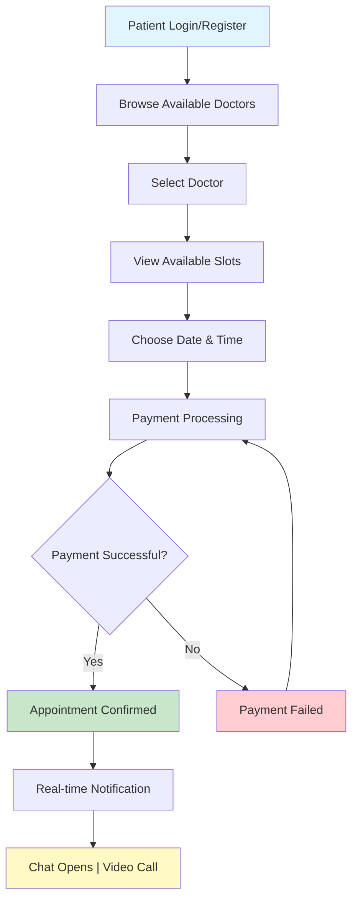
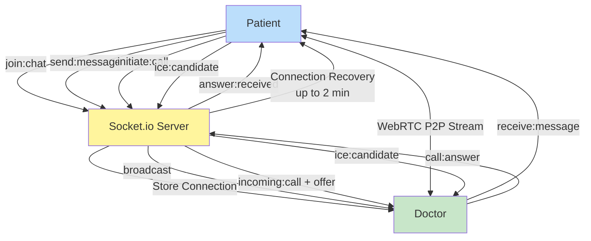
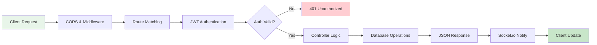

# ArogYam
**Connect Patients with Doctors. Consult Anywhere. Anytime.**

A full-stack telemedicine platform with appointment booking, real-time video/voice calls, and instant chat.

---

## Quick Features

Doctor Profiles • Smart Booking • Video Calls • Live Chat • Payments

---

## Tech Stack

```
Frontend:  React 19 • Vite • TailwindCSS • Socket.io Client
Backend:   Node.js • Express 5 • MongoDB • Socket.io
Auth:      JWT • Bcrypt
```

---

## Quick Start

### Backend
```bash
cd backend && npm install
# Create .env with MONGODB_URI and JWT_SECRET
npm start  # Runs on http://localhost:3000
```

### Frontend
```bash
cd frontend && npm install
npm run dev  # Runs on http://localhost:5173
```

---

## Architecture Overview

### **Patient Booking Flow**



### **Real-Time Communication Flow**



### **API Request Lifecycle**



---

## Project Structure

```
ArogYam/
├── backend/
│   ├── Models/          (Doctor, Patient, Appointment, Chat)
│   ├── Routes/          (API endpoints)
│   ├── Controllers/     (Business logic)
│   ├── middlewares/     (Auth, validation)
│   ├── Services/        (Socket.io handlers)
│   └── server.js        (Entry point)
│
├── frontend/
│   ├── src/
│   │   ├── pages/       (Patient, Doctor dashboards)
│   │   ├── contexts/    (Auth state management)
│   │   ├── components/  (Reusable UI)
│   │   └── utils/       (Socket.io setup)
│   └── index.html
│
└── README.md
```

---

## Key Endpoints

| Endpoint | Method | Auth | Purpose |
|----------|--------|------|---------|
| `/doctors/register` | POST | No | Doctor sign-up |
| `/doctors/available` | GET | No | Browse doctors |
| `/patients/register` | POST | No | Patient sign-up |
| `/appointments/book` | POST | Yes | Book appointment |
| `/api/chat` | WS | Yes | Real-time chat |
| `/api/calls` | WS | Yes | Video call signaling |

---

## Security

- Password hashing with **Bcrypt**
- JWT-based authentication
- CORS protection
- Rate limiting on login
- Environment variable secrets

---

## Documentation

- **Architecture Details**: See `.github/copilot-instructions.md`
- **API Docs**: See API section above
- **Database Schema**: Mongoose models in `backend/Models/`

---

## Contributing

```bash
git checkout -b feature/your-feature
git commit -m "Add feature"
git push origin feature/your-feature
```

---

**Made for healthcare. Last Updated: Dec 23, 2025**
