# 🏥 ArogYam
**Connect Patients with Doctors. Consult Anywhere. Anytime.**

A full-stack telemedicine platform with appointment booking, real-time video/voice calls, and instant chat.

---

## ✨ Quick Features

🩺 **Doctor Profiles** • 📅 **Smart Booking** • 📹 **Video Calls** • 💬 **Live Chat** • 💳 **Payments**

---

## 🛠 Tech Stack

```
Frontend:  React 19 • Vite • TailwindCSS • Socket.io Client
Backend:   Node.js • Express 5 • MongoDB • Socket.io
Auth:      JWT • Bcrypt
```

---

## � Quick Start

### Backend
```bash
cd backend && npm install
# Create .env with MONGODB_URI and JWT_SECRET
npm start  # Runs on http://localhost:3000
```

### Frontend
```bash
cd frontend && npm install
npm run dev  # Runs on http://localhost:5173
```

---

## 📊 Architecture Overview

### **Patient Booking Flow**

```mermaid
flowchart TD
    A["👤 Patient Login/Register"] --> B["🔍 Browse Available Doctors"]
    B --> C["👨‍⚕️ Select Doctor"]
    C --> D["📅 View Available Slots"]
    D --> E["⏰ Choose Date & Time"]
    E --> F["💳 Payment Processing"]
    F --> G{Payment Successful?}
    G -->|Yes| H["✅ Appointment Confirmed"]
    G -->|No| I["❌ Payment Failed"]
    I --> F
    H --> J["📱 Real-time Notification"]
    J --> K["💬 Chat Opens | 📹 Video Call"]
    
    style A fill:#e1f5ff
    style H fill:#c8e6c9
    style I fill:#ffcdd2
    style K fill:#fff9c4
```



### **Real-Time Communication Flow**

```mermaid
flowchart TD
    A["👤 Patient"] -->|join:chat| B["🌐 Socket.io Server"]
    B -->|Store Connection| C["👨‍⚕️ Doctor"]
    
    A -->|send:message| B
    B -->|broadcast| C
    C -->|receive:message| A
    
    A -->|initiate:call| B
    B -->|incoming:call + offer| C
    
    C -->|call:answer| B
    B -->|answer:received| A
    
    A <-->|WebRTC P2P Stream| C
    A -->|ice:candidate| B
    B -->|ice:candidate| C
    
    B -->|Connection Recovery<br/>up to 2 min| A
    
    style A fill:#bbdefb
    style B fill:#fff59d
    style C fill:#c8e6c9
```



### **API Request Lifecycle**

```mermaid
flowchart LR
    A["🚀 Client Request"] --> B["🔐 CORS & Middleware"]
    B --> C["🛣️ Route Matching"]
    C --> D["🔑 JWT Authentication"]
    D --> E{Auth Valid?}
    E -->|No| F["❌ 401 Unauthorized"]
    E -->|Yes| G["⚙️ Controller Logic"]
    G --> H["💾 Database Operations"]
    H --> I["✅ JSON Response"]
    I --> J["📡 Socket.io Notify"]
    J --> K["📱 Client Update"]
    
    style A fill:#e8f5e9
    style K fill:#c8e6c9
    style F fill:#ffcdd2
```



---

## 📁 Project Structure

```
ArogYam/
├── backend/
│   ├── Models/          (Doctor, Patient, Appointment, Chat)
│   ├── Routes/          (API endpoints)
│   ├── Controllers/     (Business logic)
│   ├── middlewares/     (Auth, validation)
│   ├── Services/        (Socket.io handlers)
│   └── server.js        (Entry point)
│
├── frontend/
│   ├── src/
│   │   ├── pages/       (Patient, Doctor dashboards)
│   │   ├── contexts/    (Auth state management)
│   │   ├── components/  (Reusable UI)
│   │   └── utils/       (Socket.io setup)
│   └── index.html
│
└── README.md
```

---

## � Key Endpoints

| Endpoint | Method | Auth | Purpose |
|----------|--------|------|---------|
| `/doctors/register` | POST | ❌ | Doctor sign-up |
| `/doctors/available` | GET | ❌ | Browse doctors |
| `/patients/register` | POST | ❌ | Patient sign-up |
| `/appointments/book` | POST | ✅ | Book appointment |
| `/api/chat` | WS | ✅ | Real-time chat |
| `/api/calls` | WS | ✅ | Video call signaling |

---

## � Security

- ✅ Password hashing with **Bcrypt**
- ✅ JWT-based authentication
- ✅ CORS protection
- ✅ Rate limiting on login
- ✅ Environment variable secrets

---

## � Documentation

- **Architecture Details**: See `.github/copilot-instructions.md`
- **API Docs**: See API section above
- **Database Schema**: Mongoose models in `backend/Models/`

---

## 🤝 Contributing

```bash
git checkout -b feature/your-feature
git commit -m "Add feature"
git push origin feature/your-feature
```

---

**Made with ❤️ for healthcare. Last Updated: Dec 23, 2025**
